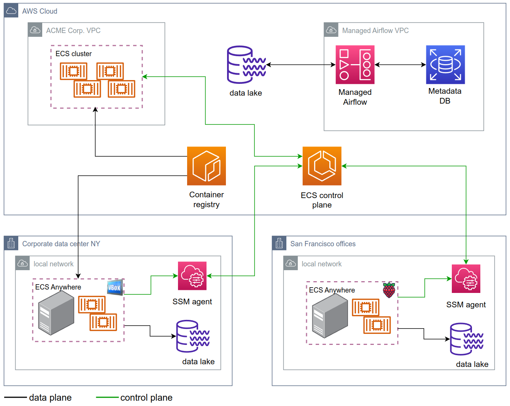

# airflow-ecs-anywhere

This repository contains source code used in the 
"[Solving data governance with Airflow and AWS ECS Anywhere](https://medium.com/@ivica.kolenkas/efea79b2449d)" article.

The article focuses on a technical solution of using a cloud-hosted ETL tool to process sensitive data where that data 
resides. It is a follow-up to a chalk-talk from AWS re:Invent 2022 in which Ricardo Sueiras talked about using AWS ECS 
Anywhere and Airflow to process data where it resides. During the demo, Ricardo showed how to use ECS Anywhere to run a 
container that performs an ETL process on the machine that hosts the data or has access to a data store. 
His [blog post](https://blog.beachgeek.co.uk/orchestrating-hybrid-workflows-with-apache-airflow/) includes much 
more details and I relied on it heavily for inspiration and on [this repository](https://github.com/094459/blogpost-airflow-hybrid)
for code samples.

The article is my answer to a question that several of us from the audience had — how to extend the demo Ricardo showed
to a real-world scenario with multiple ETL processes, multiple ECS machines and multiple data stores.

## Solution architecture diagram

For more information please refer to the 
"[Solving data governance with Airflow and AWS ECS Anywhere](https://medium.com/@ivica.kolenkas/efea79b2449d)" article.
